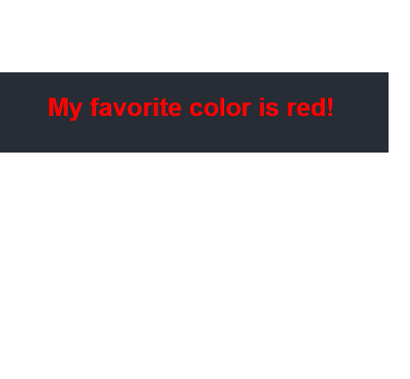

# React Buttons App
It writes to screen two styled buttons with React.
To compile download the files and insert them into a node app.
Verify if you have react package intalled.
\nGo to the folder with cmd and write the command "node start".

